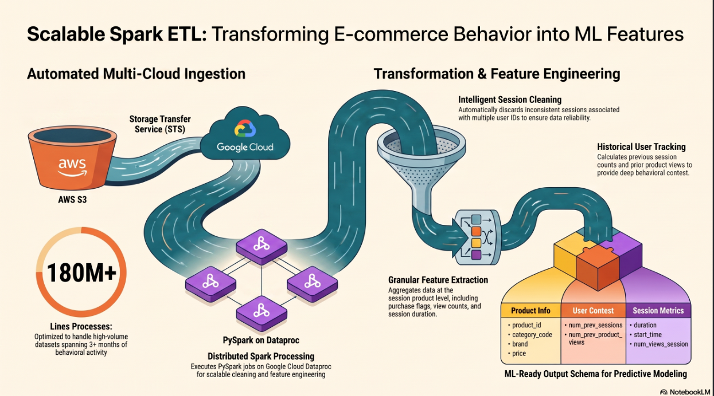
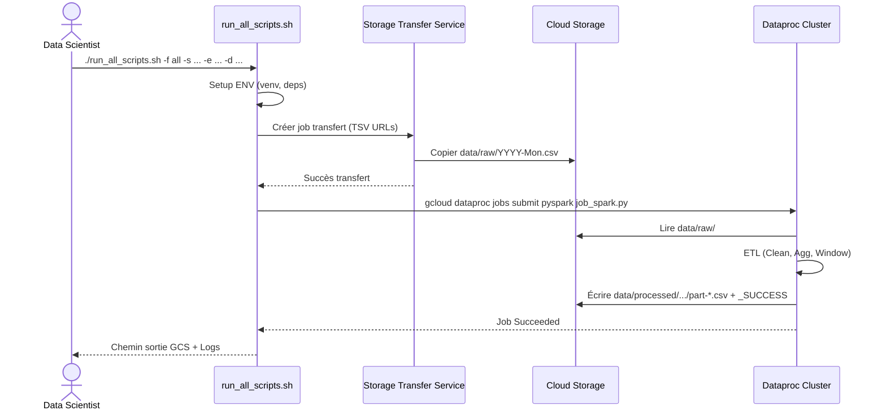

# Blent Spark ETL Project

*A scalable PySpark ETL pipeline automating data transfer and transformation between cloud storage systems.*
  


## Project Overview
- **Goal:** Transfer raw CSV files from AWS to Google Cloud Storage (GCS) and apply ETL transformations.
- **Context:** The ETL Pipeline is designed for deep behavioural analysis of e-commerce activity. It transforms raw event data (visits, clicks, cart additions, and purchases) into a structured learning dataset. This enables Data Science teams to identify "hesitant buyers" and deploy automated, personalised marketing interventions, such as targeted discount coupons.
- **Key Features:**
*   **Automated Data Ingestion**: Seamlessly transfers monthly CSV files (5-9 GB each) from AWS S3 to Google Cloud Storage (GCS) using the **Storage Transfer Service (STS)** [3-5].
*   **Large-Scale Processing**: Cleans and aggregates data across multiple months (e.g., 180M+ rows for 3 months) using distributed Spark processing [2, 3].
*   **Feature Engineering**: Automatically calculates behavioral metrics at the **session × product** grain, including historical user activity [6, 7].
*   **Performance Optimization**: Features intelligent caching (for datasets < 200M rows) and dynamic partitioning to ensure optimal resource usage [8].
*   **Robust Orchestration**: A single entry point handles environment setup, data transfer, and Spark job submission with integrated logging and error handling [9, 10].
---
## Architecture
**Sequence Diagram:**  

---
## 📂 Repository Structure
```
.
├── src/
│   ├── etl_job.py          # Main ETL script
│   ├── job_spark.py        # Spark job entry point
│   ├── job_transfer.py     # AWS → GCS transfer utility
│   ├── lib_common.py       # Shared utilities
│   ├── nbook_prototype.ipynb
│   └── nbook_cloud.ipynb
├── tests/
│   ├── mock_data.csv       # Sample input for tests
│   ├── expected_output.csv # Reference output
│   └── test_etl_job.py     # Pytest suite
├── .env_template           # Configuration template
├── requirements.txt        # Python dependencies
├── run_all_scripts.sh      # Convenience runner
├── setup_data_services.sh  # GCS/S3 bucket provisioning
└── README.md
```
---
## 🛠️ Technical Stack
*   **Language**: Python 3.8 (current version in DataProc clusters of Blent users).
*   **Big Data**: PySpark (Spark/Hadoop) on Google Cloud Dataproc.
*   **Cloud Infrastructure**: Google Cloud Platform (GCS, STS, IAM).
*   **Orchestration**: Bash scripting.
*   **Quality Assurance**: Pytest for unit and integration testing.
---
## ⚙️ Setup and Configuration

### 1. Infrastructure Preparation
Ensure that the following GCP APIs are enabled: Dataproc, Cloud Storage, and Storage Transfer Service. Users must have `Storage Admin` and `Dataproc Admin` IAM roles.

### 2. Storage Configuration
Edit `config.ini` with your specific settings for the source URL, bucket name, region.

### 3. Repository Download
```bash
git clone https://github.com/JeanRosselVallee/Blent_Spark.git
cd Blent_Spark
```
### 4. Environment Installation
(This step is included in `run_all_scripts.sh`)
```bash
chmod +x ./setup_env_dev.sh
source ./setup_env_dev.sh
```
### 5. Data Services Configuration
Initialize GCP authentication and create the necessary GCS bucket and IAM bindings.

(This step is included in `run_all_scripts.sh`)
```bash
chmod +x ./setup_data_services.sh
source ./setup_data_services.sh
``` 
---
## 📊 Usage Guide

The `run_all_scripts.sh` script is the primary interface for running the pipeline but Transfer and Spark jobs can be run individually.

### 1. `run_all_scripts.sh` Syntax

```bash
./run_all_scripts.sh -f <phase> -s "YYYY-MM-DD HH:MM:SS" -e "YYYY-MM-DD HH:MM:SS" -d "gs://<BUCKET_NAME>/<output_path>"
```

**Arguments**

| Parameter | Required | Description |
| :--- | :--- | :--- |
| `-f` | No | Start phase. Values : `1` or `all` (default : setup + transfer + Spark), `3` or `transfer` (transfert + Spark), `4` or `spark` (Spark uniquement). |
| `-s` | **Yes** | `DATE_START` in `YYYY-MM-DD HH:MM:SS` format (e.g.: `"2019-12-01 00:00:00"`). |
| `-e` | **Yes** | `DATE_END` in `YYYY-MM-DD HH:MM:SS` format (e.g.: `"2020-01-15 00:00:00"`). Must be > `DATE_START`. |
| `-d` | No | `DESTINATION` : full GCS path where the final CSV will be saved. E.g., `"gs://blent_spark_bucket9/data/processed/campaign_q4_2019"`. If omitted, uses the default path from  `config.ini`. |

**Examples**

```bash
# Extraction over two months (December 2019 and January 2020), with automatic transfer
./run_all_scripts.sh -f all -s "2019-12-01 00:00:00" -e "2020-01-31 00:00:00" -d "gs://blent_spark_bucket9/data/processed/experiment_dec_jan"

# Extraction over a fortnight (data is already in GCS, skipping transfer)
./run_all_scripts.sh -f spark -s "2019-10-01 00:00:00" -e "2019-10-15 00:00:00" -d "gs://blent_spark_bucket9/data/processed/test_quick"

# Extraction over a period without specifying a destination (uses default path)
./run_all_scripts.sh -f spark -s "2020-02-01 00:00:00" -e "2020-02-28 00:00:00"
```

### 2. `job_transfer.py` Syntax
(The call to this script is included in `run_all_scripts.sh`)
```bash
python3 -m src.job_transfer --DATE_START="YYYY-MM-DD HH:MM:SS" --DATE_END="YYYY-MM-DD HH:MM:SS"
```

### 3. `job_transfer.py` Syntax
(The call to this script is included in `run_all_scripts.sh`)
```bash
BUCKET_NAME=`grep "^BUCKET_NAME =" ./src/config.ini | cut -d" " -f 3`
GCS_PATH="gs://$BUCKET_NAME"
GCS_PATH="gs://blent_spark_bucket5"
FILEPATHS="src/config.ini src/job_spark.py src/lib_common.py"
for PATH_i in $FILEPATHS; do
    gcloud storage cp ./$PATH_i ${GCS_PATH}/$PATH_i
done

gcloud dataproc jobs submit pyspark $GCS_PATH/src/job_spark.py \
--cluster=main-cluster --region=us-central1 \
--files="$GCS_PATH/src/config.ini" \
--py-files="$GCS_PATH/src/lib_common.py" -- \
--DATE_START="YYYY-MM-DD HH:MM:SS" --DATE_END="YYYY-MM-DD HH:MM:SS" \
--DESTINATION="${GCS_PATH}/data/processed/run_20260714"
```
---
## 📝 Output Data Model
The output is a CSV table partitioned by Spark, located in the specified `DESTINATION`. Each row represents a unique **user_session × product_id** pair with the following features:

*   **Product Info**: `product_id`, `category_code`, `brand`, `price`.
*   **Behavioral Labels**: `purchased` (Target: 1 if bought, 0 otherwise).
*   **Session Metrics**: `num_views_product`, `num_views_session`, `duration` (seconds).
*   **Temporal Context**: `start_time` (HH:MM), `start_weekday`.
*   **User History**: `num_prev_sessions`, `num_prev_product_views`.
---
## 🧪 Testing and Quality
The pipeline includes a comprehensive test suite to ensure data integrity:
*   **Unit Tests**: Validates cleaning rules (e.g., removing multi-user sessions) and feature calculations.
*   **Integration Tests**: Runs the full ETL logic on `mock_data.csv` and compares it against `expected_output.csv`.
*   **Execution**:
```bash
pytest ./tests/test_etl_job.py -vv --disable-warnings
```
---
## 🛡️ Monitoring
*   **Success Verification**: A successful run is confirmed by the presence of a `_SUCCESS` file in the destination directory.
*   **Logs**: 
    - Check `log/run_all_scripts_<timestamp>.log` for detailed execution steps and performance metrics.
    - If run individually, check `job_transfer.log` for the transfer job 
*   **Jobs' Progress**: 
    - For the transfer job, the terminal displays real-time percentage and volume updates.
    - For the Spark job, it displays a progress tracking bar of the executors' tasks. E.g.: `[Stage 8:=====>    (8 done + 4 active) / 20 total]`
*   **GC Console**: 
    - For transfer job, search icon : "Storage Transfer" or "Transfer Jobs"
    - For Spark job, search icon : "Spark Jobs" (or "Managed Apache Spark" -> "Jobs")
---
## Required Implementation Phases
*   **Prototyping on a sample**: A Jupyter notebook `./src/nbook_prototype.ipynb` was developed to design Spark transformations step-by-step using a 150 MB extract (October 2019 sample). This notebook served to validate calculation formulas (aggregations, window functions, joins) and define the final structure of the output table.
*   **Parameterization and target writing**: The `.job_spark.py` script was adapted to read `DESTINATION`, `DATE_START`, and `DATE_END` parameters via `argparse`. Results are written in CSV format to the target system GCS.
*   **Unit and integration tests**: The `tests/` directory includes:
- `mock_data.csv`: a small synthetic dataset.
- `expected_output.csv`: the corresponding reference output.
- `test_etl_job.py`: a Pytest suite that validates data cleaning, aggregation, and feature calculation functions on the mock data, as well as the integration of the complete pipeline (extraction → transformation → loading into memory).
*   **Real-world testing**: A Dataproc cluster (Hadoop + Spark) was provisioned using the setup_data_services.sh script. The job was executed using two-month date ranges (e.g., 2019-12-16 to 2020-01-15) to validate the system's performance and stability under actual load.
